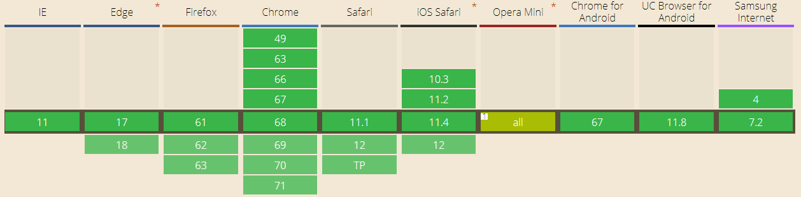

# mt-events
Handle mobile events on the web easily

 [](https://codecov.io/gh/jerryOnlyZRJ/mobile-events)  [](https://www.npmjs.com/package/mt-events)   [](https://www.npmjs.com/package/mt-events)    

## Features

* mt-events can be used in the browser directly
* Supports widely-used mobile terminal events such as double tap and long tap, in addition to native web events like clicking. With mt-events, you could listen for these mobile/web events just the way you would using the native `addEventListener` web API or JQuery.
* Allows for event delegation; all you need to do is adding an extra argument.
* The whole library is only 2KB after gzip. We will deploy the script to our CDN as soon as possible.
* Use **WeakMap** to manage the reference of HTMLElement and its event handler, so there is no need for you to remove the event handler after you remove a HTMLElement, the weak reference will be recycled by GC.

## Browser Support

 |  |  |  |  |  |
--- | --- | --- | --- | --- | --- |
Latest ✔ | Latest ✔ | Latest ✔ | Latest ✔ | Latest ✔ | 11 ✔ |



## Usage

### url

Include the (minified) **mtevents.min.js**  script file in your HTML:

```html
<script src="http://mtevents.jerryonlyzrj.com/mtevents.min.js"></script>
```

Then use the `mtEvents` function directly in your JavaScript code:

```js
mtEvents('#bindTarget', 'click', e => console.log('click'))
```

### npm

The following is an example of using MtEvents like a Node.js module, inside a Vue file for instance.

Install the **mt-events** package with [npm](https://www.npmjs.org/):

```shell
npm i mt-events
```

Require and use it like such:

```html
//test.vue
<script>
const mtEvents = require('mt-events')
export default {
    ...,
    mounted(){
        mtEvents('#bindTarget', 'click', e => console.log('click'))
    }
}
</script>
```

## Tests

This project comes with unit tests. You can run the test with:

```shell
npm t
```

A coverage file is included in the **test** folder.

## Docs

### Users
See the user API documentations below for your reference ⬇️

[中文文档](https://github.com/jerryOnlyZRJ/mobile-events/blob/master/docs/user/docs(zh).md)

[Documentation](https://github.com/jerryOnlyZRJ/mobile-events/blob/master/docs/user/docs(en).md)

### Developers

Run the command below to create the **developer** sub-directory inside the **docs** folder:

```shell
npm run docs
```

