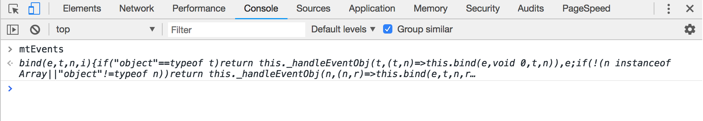
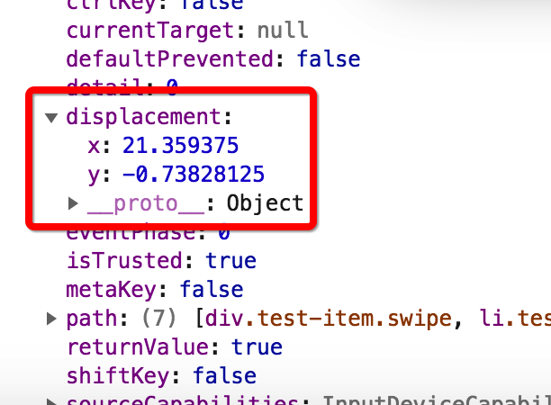
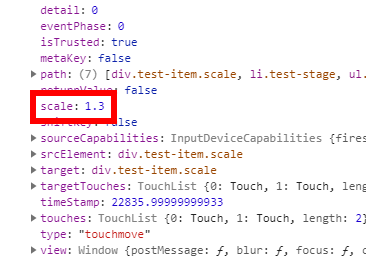
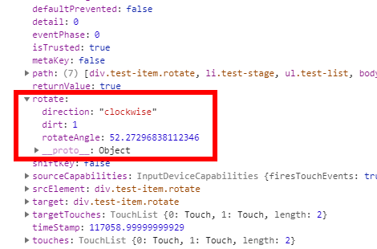

# mt-events使用文档

便捷事件绑定和委托，让移动端事件如原生事件般友好。

## 介绍

### mt-events是什么？

mt-events全名是Mobile Terminal Events，在最初定位时我们是希望封装一些常用的移动端事件来方便用户进行更为便捷的移动端开发，例如双击事件、长按事件、滑动事件等等，后来，随着项目的迭代，mt-events的功能更倾向往前端事件绑定工具的趋势发展，因为我们集成了事件委托等，您可以像使用JQuery的on方法那样使用我们的mtEvents，而且我们的工具库经过代码压缩、gzip之后，仅仅只有2KB哦～您可以将它下载到本地，也可以使用`script`标签引入我们为您提供的url。接下来，我们将带您体验mt-events所拥有的魅力。

### 起步

如果您想在HTML页面里引入我们的mt-events工具库，可以通过如下方式：

```js
<script src="http://mtevents.jerryonlyzrj.com/mtevents.min.js"></script>
```

然后，我们的工具函数mtEvents将会被挂载在window对象上，您可以在浏览器的开发者工具里的console面板输入并执行mtEvents，如果打印出如下文本说明您已经成功引入我们的工具库了：



或者您是VUE等前端框架的开发者，您也可以通过npm依赖的方式引入我们的工具：

首先，将我们的工具库以上线依赖的形式安装：

```shell
npm i mt-events --save
```

然后就可以在我们的.vue等文件里直接引入使用啦：

```html
//test.vue
<script>
const mtEvents = require('mt-events')
export default {
    ...,
    mounted(){
    	mtEvents('#bindTarget', 'click', e => console.log('click'))
	}
}
</script>
```

**实际上，mtEvents的执行环境还是在浏览器里，不论是通过script引入还是使用npm依赖，最后都需要在浏览器环境中执行。**

### 事件处理

#### 事件绑定：mtEvents(bindTarget, delegateTarget, event, callback)

工具函数mtEvents用于事件绑定，它默认可以传入4个参数，它们分别是：

* **bindTarget**

  类型：String(Selector) | HTMLElement

  事件绑定的DOM元素对象，传入的值可以是一个DOM元素或者符合CSS选择器规范的字符串，工具会自动选取被选择器选中的**第一个**DOM元素。

* **delegateTarget**

  类型：String(Selector)

  事件委托元素，符合CSS选择器规范的字符串，如果您不需要这个值，可以忽略不填，具体可参考下方的示例代码。

* **event**

  类型：String

  单个事件的名称，可以是浏览器的原生事件，亦或是我们为您封装好的移动端常用事件（后方将会有封装事件的具体使用文档）。

* **callback**

  类型：Function

  事件触发时执行的回调函数，接受一个形参`event`，在回调函数执行时我们将传入触发回调的原生事件对象`event`。

#### 事件绑定代码示例

1⃣️**基础用法**：如果您单纯地想为某个元素绑定某个事件的回调，你可以这样使用mtEvents：

```js
//您可以赋予第一个参数一个字符串
mtEvents('#bindTarget', 'click', e => console.log('BindTarget is clicked'))
//或者直接传入一个DOM对象
var bindTarget = document.querySelector('#bindTarget')
mtEvents(bindTarget, 'click', e => console.log('BindTarget is clicked'))
```

2⃣️**绑定封装事件**：同理，绑定我们为您封装的事件也是同样的方法：

```js
//此代码将为您的目标元素绑定长按事件
mtEvents('#bindTarget', 'longtap', e => console.log('BindTarget is longtap'))
```

3⃣️**使用事件委托**：如果您需要进行事件委托，只需要在第二个参数传入事件触发元素即可：

```js
mtEvents('#bindTarget', '#delegateTarget', 'click', e => console.log('BindTarget is clicked'))
```

如此一来，事件监听将会被绑定在id为bindTarget的DOM元素上，当e.target为delegateTarget或其子元素时，才会触发回调。

4⃣️**为单一元素绑定多个事件**：如果您需要为某个元素绑定多个事件回调，我们为您提供了便捷方案：

```js
mtEvents(node, {
    click: e => console.log('BindTarget is clicked'), 
    longtap: e => console.log('BindTarget is longtap')
})
```

您可以传入一个事件回调对象，对象的键是事件名称，值为事件对应的回调。

#### 事件移除：mtEvents.remove(bindTarget, event, callback)

工具函数mtEvents上挂载的**remove**方法用于移除您通过mtEvents绑定的事件，它默认可传入三个参数，它们分别是：

* **bindTarget**

  类型：String(Selector) | HTMLElement

  同理事件绑定方法，事件绑定的DOM元素对象，传入的值可以是一个DOM元素或者符合CSS选择器规范的字符串，工具会自动选取被选择器选中的**第一个**DOM元素。

* **event**

  类型：String

  同理事件绑定，您绑定在元素上的事件名称。

* **callback**

  类型：Function

  相应事件触发时执行的回调函数。

#### 事件移除代码示例：

同理事件绑定，您可以使用基础用法移除某个元素上的绑定事件：

```js
const handler = () => console.log('handler')
mtEvents('#bindTarget', 'click', handler)
mtEvents.remove('#bindTarget', 'click', handler)
```

**特别注意：如果您后续需要移除事件，在事件绑定时请不要使用匿名函数！！！否则将无法正常移除事件。**

您也可以像事件绑定时那样传入一个事件回调对象来移除多个事件绑定：

```js
const clickHandler = () => console.log('clickHandler')
const longtapHandler = () => console.log('longtapHandler')
mtEvents.remove(node, {
    click: clickHandler, 
    longtap: longtapHandler
})
```

## 封装事件

### 单点触控事件

#### Tap

移动端单击事件，通过监听 touchstart 和 touchend 判断用户 touch 的时间是否超过指定阈值（默认为300ms）触发事件，使用方法：

```js
mtEvents('#bindTarget', 'tap', e => console.log('BindTarget is tap'))
```

#### Longtap

移动端长按事件，通过监听touchstart和touchend判断用户touch的时间是否超过指定阈值（默认为1s）触发事件，使用方法：

```js
mtEvents('#bindTarget', 'longtap', e => console.log('BindTarget is longtap'))
```

封装事件longtap的callback还可以接受一个数组，您也可以使用如下方法传入callback：

```js
const longtap = e => console.log('BindTarget is longtap')
const shorttap = e => console.log('BindTarget is shorttap')
mtEvents('#bindTarget', 'longtap', [longtap, shorttap])
```

这么一来，用户如果长按，将触发长按事件，如果短按，将触发短按事件。

#### Dbtap

移动端双击事件，通过监听两次tap的间隔时间和位置判断用户是否在某一范围内双击屏幕，使用方法：

```js
mtEvents('#bindTarget', 'dbtap', e => console.log('BindTarget is dbtap'))
```

#### Swipe

移动端滑动事件，通过监听touchstart和touchend的位置判断用户的手势发生了哪些偏移，执行相应回调，具体使用方法：

```js
mtEvents('#bindTarget', 'drag', e => console.log('BindTarget is drag'))
```

mtEvents会在事件的原生对象上挂载元素偏移对象（displacement），其中包含了元素在x轴和y轴上的偏移量:



#### Drag

移动端拖拽事件，通过监听touchmove判断用户手势发生了哪些偏移，执行相应回调。

**drag与swipe的不同**：drag会持续监听用户手势，只要发生移动就持续触发事件，而swipe值关注用户手势的初始位置和结束为止，只会在touchend的时候触发一次事件。

用法完全类同swipe，这里就不再做相关描述。

### 多点触控事件（双指）

#### Scale

移动端缩放事件，监听用户双指缩放手势，计算出缩放比例并挂载在原生事件对象event上供用户使用，使用方法：

```js
mtEvents('#bindTarget', 'scale', e => console.log('BindTarget is scale'))
```

mtEvents会在事件的原生对象上挂载元素缩放比例（scale）：



#### Rotate

移动端旋转事件，监听用户双指旋转手势，计算出旋转角度及旋转方向并挂载在原生对象上供用户使用，使用方法：

```js
mtEvents('#bindTarget', 'rotate', e => console.log('BindTarget is rotate'))
```

mtEvents会在事件的原生对象上挂载元素旋转对象（rotate）：



rotate对象内包含三组键值，它们的含义分别是：

* **direction**：旋转方向书面术语，clockwise（顺时针）|| anti clockwise（逆时针）
* **dirt**：旋转方向数学符号，顺时针为1，逆时针为0
* **rotateAngle**：旋转角度