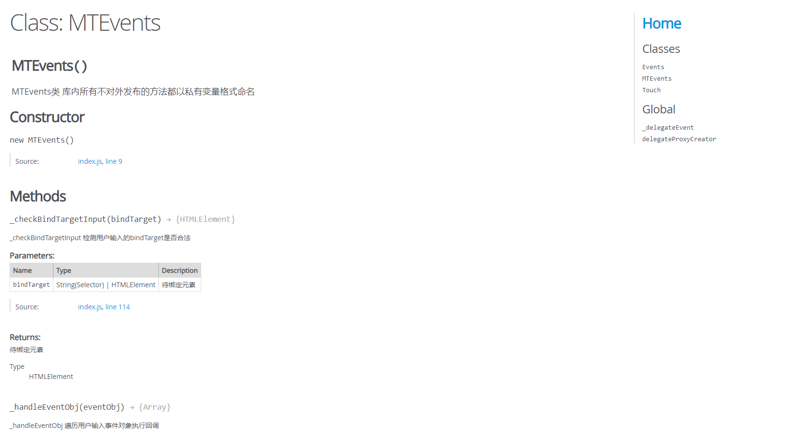
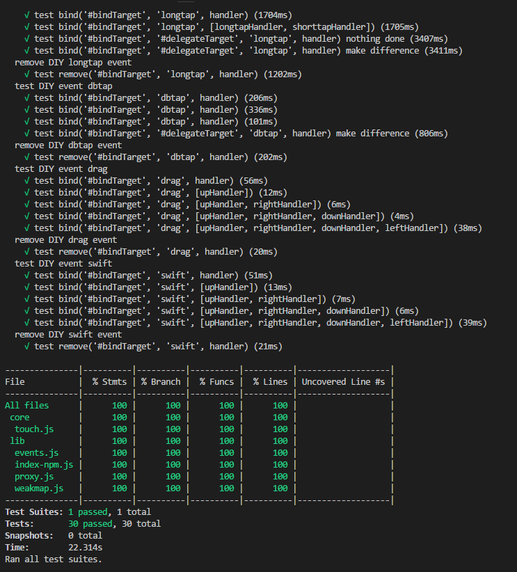
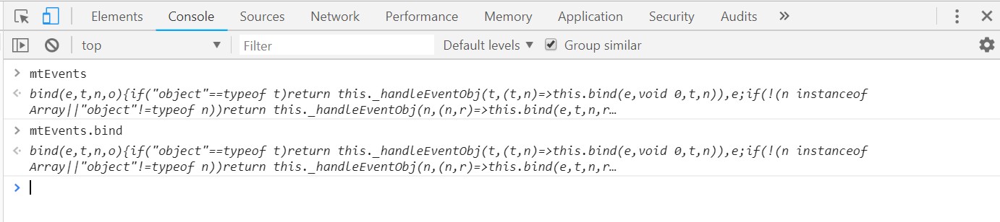

# mt-events

## 需求分析

最近在 H5 与 APP 联调的过程中， 经常需要实现一些常用的移动端事件封装成接口提供给 app，例如用户的单击 tap 事件、双击事件、长按事件以及拖动事件。但由于浏览器默认只提供了`touchstart`、`touchmove`、`touchend`三个原生事件，在实际的开发过程中，我们常用的解决方案便是通过监听`touchstart`和`touchend`事件配合定时器来实现我们的自定义移动端事件，为了实现常用自定义事件的复用，我们对其进行了封装，并提供方便用户使用的工具函数，这也是我们实现 mt-events 的初衷。

mt-events 全名是 Mobile Terminal Events。最初我们对这个库的定位是希望封装一些常用的移动端事件来方便用户进行更为便捷的移动端开发，例如双击事件、长按事件、滑动事件等等。后来，随着项目的迭代，mt-events 的功能更倾向往前端事件绑定工具的趋势发展，因为我们集成了事件委托等，您可以像使用 JQuery 的 on 方法那样使用我们的 mt-events，更加便捷事件绑定和委托，让移动端事件如原生事件般友好。 这是我们项目的Github地址：https://github.com/jerryOnlyZRJ/mobile-events。

接下来，我们将带您体验一款工具库的搭建流程，ES6 新特性 Map、Proxy、Reflect 以及 WeakMap 在我们的工具库中发挥的作用，以及我们开源的工具库**mt-events**所拥有的魅力。 

------
## mt-events初探

先看看 mt-events 这款工具库具有哪些特性：

- 普遍性：封装常用的**移动端事件**：
  - 单击
  - 双击
  - 长按
  - 滑动
  - 拖拽
- 便捷性：在全局挂载工具函数，绑定事件如 $.on() 般丝滑；封装事件代理，只需要像 JQuery 那样传入被代理元素的选择器即可。
- 新语法：使用 Map 映射事件回调，便捷事件移除；使用 WeakMap 实现 DOM 元素与回调的弱引用，预防内存泄漏。
- 轻量级：代码压缩 + gzip，只有大约 **2KB**。

那么，我们又该如何使用它呢？这里提供了两种引用工具库的方式，最常用的当然是从 HTML 里使用 script 引入：

```js
<script src="http://mtevents.jerryonlyzrj.com/mtevents.min.js"></script>
```

然后，我们的工具函数 mtEvents 将会被挂载在 window 对象上，您可以在浏览器的开发者工具里的 console 面板输入并执行 mtEvents，如果打印出如下文本说明您已经成功引入我们的工具库了：


或者您是 VUE 等前端框架的开发者，您也可以通过 npm 依赖的方式引入我们的工具，我们的工具库会跟随您们的 VUE 文件被打包进 bundle 里。

首先，将我们的工具库以上线依赖的形式安装：

```shell
npm i mt-events --save
```

然后就可以在我们的 .vue 等文件里直接引入使用：

```html
//test.vue
<script>
const mtEvents = require('mt-events')
export default {
    ...,
    mounted(){
    	mtEvents('#bindTarget', 'click', e => console.log('click'))
	}
}
</script>
```

具体的使用方法，您可以参照我们 Github 为您提供的用户文档哦～

## 如何搭建一款属于我们自己的开源库

### 选择一款合适的测试工具

​	没有经过测试的代码不具备任何说服性。相信大家在浏览别人开源的工具库代码时，都能在根目录下见到一个名为test的文件夹，其中就放置着项目的测试文件。特别对于工具库来说，测试更是一个不可或缺的环节。

​	市面上的测试工具种类繁多，例如 Jest，Karma，Mocha，Tape等，并不需要局限与哪一款，下面我们对这几种框架进行了一些对比。

- [Jest](https://jestjs.io/)
  - facebook 开源的 js 单元测试框架
  - **集成 JSDOM，mt-events 库主要适用于移动端，集成 JSDOM 能够让我们更好地去模拟移动端事件**
  - 基于 Istanbul 的测试覆盖率工具，会在项目下生产一个 coverage 目录，内附一个优雅的测试覆盖率报告，让我们可以清晰看到优雅的测试情况
  - 开箱即用，配置很少，只需要 npm 命令安装即可运行，UI 层面清晰，而且操作简单
  - 基于并行测试多文件，在大项目中的运行速度很快
  - 内置 Jasmine 语法，以及添加了很多新特性
  - 内置 auto mock，自带 mock API
  - 支持断言和仿真，不需要引入第三方断言库
  - 在隔离环境下测试，支持快照测试
  - 较多用于 React 项目(但广泛支持各种项目)
  - 比较新，社区还不是很成熟
- [Karma](https://karma-runner.github.io/2.0/index.html) 
  - google Angular 团队开源的 JavaScript测试执行过程管理工具
  - 配置简单方便
  - 强大适配器，可以在 karma 上面配置 jasmine，mocha 等单元测试框架
  - 可提供真实的模拟环境，可以在 chrome，firefox 等各种浏览器环境进行配置
  - 开发者可以自己把控整个自动化测试流程，实现更加自动化，当我们编辑保存的时候，即可运行全部的测试用例
  - 高扩展性，支持插件开发
  - 支持 ci 服务
  - 执行速度快
  - 支持远程控制以及支持调试
- [Mocha](https://mochajs.org/)
  - 学习成本比较高，但随之带来的是它能提供更好的灵活性和可扩展性
  - 社区成熟，在社区上可以找到各种的特殊场景下可用的插件或者扩展
  - 需要较多的配置，配置相对比较麻烦
  - 自身集成度不高，需要和第三方库结合（通常是 Enzyme 和 Chai）才能有断言、mocks、spies 的功能
  - 默认创建全局的测试结构
  - 终端显示友好
  - 目前使用最广泛的库
- [Tape](https://github.com/substack/tape)
  - 开发者只需要用 node 执行一个 js 脚本，直接调用 API 即可
  - 最精简，体积最小，提供简单的结构和断言
  - 只提供最底层最基础的 API
  - 没有定义全局变量，开发者可以随意更改测试代码
  - 不需要 CLI 客户端环境，只需要能够运行 js 环境，即可运行 Tape

综上所述，Jest 开箱即用，里边啥都有提供全面的方案；为大型项目配备足以快速上手的框架，建议使用Karma；Mocha 用的人最多，社区最成熟，灵活，可配置性强易拓展；Tape 最精简，提供最基础的东西最底层的API。

下面我们举个例子如何安装配置使用  **Jest**：
```shell
npm i jest -D  # 安装 Jest

// jest.config.js   # 在 jest.config.js 配置需要测试的代码路径，以及覆盖率输出文档的目录
module.exports = {
    testURL: 'http://localhost',
    testMatch: ['<rootDir>/test/*.js'],
    coverageDirectory: '<rootDir>/test/coverage',
    coverageThreshold: {
        global: {
            branches: 90,
            functions: 90,
            lines: 90,
            statements: 90
        }
    }
}

// package.json # 配置运行指令
"scripts": {
    "test": "jest --coverage"
}

// index.js     # 编写测试用例
describe('test dbtap events', () => {
	test('test 1+1', () => {
        expect(1+1).toBe(2) 
	})
})

// npm t        # 运行测试用例
> test-lib@1.0.0 test D:\test-lib
> jest

 PASS  test/index.js
  test dbtap events
    √ test 1+1 (3ms)

Test Suites: 1 passed, 1 total
Tests:       1 passed, 1 total
Snapshots:   0 total
Time:        1.786s
Ran all test suites.
```

### 使用eslint规范团队代码

在团队开发的工作中，代码维护所占的时间比重往往大于新功能的开发。因此制定符合团队的代码规范是至关重要的，这样不仅仅可以很大程度地避免基本语法错误，也保证了代码的可读性，方便维护。
 ```	
	程序是写给人读的，只是偶尔让计算机执行一下。
															--Donald Knuth
 ```
众所周知，eslint 是一个开源的 JavaScript 代码检查工具，可以用来校验我们的代码，给代码定义一个规范，团队成员按照这个代码规范进行开发，这保证了代码的规范。使用 eslint 可以带来很多好处，可以帮助我们避免一些低级错误，可能一个小小的语法问题，让你定位了很久才发现问题所在，而且在团队合作的过程中，可以保证大家都按照同一种风格去开发，这样更方便大家看懂彼此的代码，提高开发效率。

另外，eslint 的初衷是为了让开发者创建自己的代码检测规则，使其可以在编码过程中发现问题，扩展性强。为了方便使用，eslint 也内置了一些规则，也可以在这基础上去增加自定义规则。

```shell
eslint --init  # 如果不自定义自己的规则，可以选择第二个选项，用一种比较流行的内置规则规范代码
```

### 选择您最熟悉的构建工具

从事前端的开发者都会忍不住感叹前端技术发展之快，稍微过一阵子不关注新的技术，就会发现自己已经跟不上前端的迭代脚步了，会出现新思想和新框架，但是有一个特点就是源代码不能直接运行，终究需要一个构建工具来进行转换才能正常运行。

构建工具做的事情就是将一系列流程用代码去实现，自动化地去执行一系列复杂的操作，最终实现将源代码转换成可以执行的 JavaScript、CSS、HTML 代码。构建工具层出不穷，例如 Grunt，Gulp，Webpack，Rollup 等等。下面我们对这几种工具进行一些对比。

- [Grunt](https://gruntjs.com/)
  - Grunt 有大量可复用的插件，封装成常用的构建任务
  - 灵活性高
  - 集成度不高，配置麻烦，无法做到开箱即用
  - 相当于 Npm scripts 的进化版
- [Gulp](https://www.gulpjs.com.cn/)
  - 基于流的自动化构建工具
  - 可以管理任务和执行任务
  - 可以监听文件的变化以及读写文件，流式处理任务
  - 可以搭配其他工具一起使用
  - 集成度不高，配置麻烦，无法做到开箱即用
- [Webpack](https://webpack.docschina.org/)
  - 一款打包模块化的 JavaScript 工具
  - 通过 loader 转换文件，通过 Plugin 注入钩子，最后输出由多个模块组合成的文件。 
  - 专注处理模块化的项目，不适用于非模块化项目
  - 丰富完整，同时也可通过 Plugin 扩展
  - 开箱即用，开发体验不错
  - 社区成熟活跃，可以在社区中找到各种特殊场景的插件扩展
- [Rollup](https://www.rollupjs.com/guide/zh)
  - 类似 webpack 但专注于 ES6 模块的打包工具
  - 针对 ES6 源码进行 Tree Shaking，移除只被定义但没有被使用的代码
  - 针对 ES6 源码进行 Scope Hoisting，以减少输出文件的大小和提升运行性能
  - 配置和使用简单，但不如 webpack 那么完善
  - 社区生态链还不够成熟，很多特殊场景下无法找到解决方案

综上所述，webpack 成为我们构建工具中的首选，适应近几年的"模块化 + 新框架 + 新语言"趋势，还能提供一站式的解决方案。

webpack 能够灵活处理文件的方式，使用方法大致如下：

```shell
module.exports = {
    mode: "production",
    entry: './lib/index-Browser.js',
    output: {
    	filename: "mtevents.min.js"
    },
    resolve: {
    	extensions: [".js"],
    }
}	
```


### 配置JSDoc为后来之人扫清障碍

​	项目的维护工作是延伸项目生命周期的最关键手段，阅读别人的源码相信对大家来说都是一件费力的事情，特别是当原作者不在您身边或者无法给您提供任何信息的时候，那就更是悲从中来。所以，书写完善的注释是开发过程中需要养成的良好习惯。为了提升代码的可维护性，我们都会在主干代码上完善我们的注释，并且，市面上有一款工具，它能够自动将我们的注释转化成API文档，生成可视化页面，听起来是很神奇吧，先别着急，听我娓娓道来。

​	这款工具名为JSDoc，它是一款根据 Javascript 文件中注释信息，生成 JavaScript 应用程序或库、模块的 API 文档的工具。JSDoc 分析的源代码是我们书写的符合Docblock格式的代码注释，它会智能帮我们生成美观的API文档页面，我们要做的，只是简单的跑一句`jsdoc`命令就可以了。

下面是 mt-events的 API 文档（很美观不是吗？这些都是JSDoc自动生成的）：


​	简约的风格让人开起来心旷神怡，想想如果有后来的维护者想要快速了解您的项目的大体架构和具体方法的功能，献上这样一份开发者文档可不是要比直接丢给他一份源代码要来的好得多对吧。

### 让持续集成工具帮您实现自动化部署

### 为您的项目添加开源许可证

### 添加一些您喜欢的Icon来修饰您的项目吧

​	当我们花费了很多精力去构建完善我们的项目后，希望有更多的人来关注以及使用我们的项目。此时我们如何更好地向其他人展示自己的项目呢？给自己的项目添加一些好看的徽标是一种不错的选择，让人耳目一新。

​	我们平时在逛 github 网站的时候，发现不少项目都在  README.md 中添加徽标，对项目进行标记和说明，这些小图标给项目增色不少，不仅简单美观，而且还包含清晰易懂的信息。

​	GitHub 徽标的官方网站是 <http://shields.io/> ，可以在上面选择喜欢的徽标来为自己的项目润色，常见的徽标主要有持续集成状态，代码测试覆盖率，项目版本信息，项目下载量，开源协议类型，项目语言等，下面根据我们项目简单罗列几个图标讲一讲如何生成。

- 持续集成状态

  - 持续集成按照前面的模块推荐使用 [Travis CI](https://travis-ci.org/)，在项目中添加一个 `.travis.yml` 配置文件，告诉 Travis CI 怎样对你的项目进行编译或测试，具体配置关注上一个模块。

  - 然后徽标图片地址是

    ```
    http://img.shields.io/travis/{GitHub 用户名}/{项目名称}.svg
    ```

    将上面 URL 中的 {GitHub 用户名} 和 {项目名称} 替换为自己项目的即可，最后可以将集成完成后的 markdown 代码贴在自己的项目上

  - 效果图是：

- 项目版本信息

  - 项目版本信息，是根据不同的发布工具来制定的。https://shields.io/#/examples/version 在这个网站上可以找到不同的发布工具的徽标图片地址。
  - 这里以我们的库做示例，以 npm 方式发布出去的：https://img.shields.io/npm/v/npm.svg 
  - 效果图是：

- 项目下载量

  - 项目被下载的次数，是根据不同的平台独立统计的。http://shields.io/#/examples/downloads 在这个网站上可以找到各种统计平台的徽标图片地址。
  - 这里以我们的库做示例，以 npm 方式发布出去的，且以每周下载量的维度来看：https://img.shields.io/npm/dw/localeval.svg 
  - 效果图是：

## mt-events从0到1

### 目录结构
```shell
mt-events
├── core                   # 源代码文件夹
│   ├── event.js           # 自定义事件处理句柄生成器，包含长按，双击，滑动，拖拽事件
│   ├── index.js           # mtEvents 类以及绑定，移除事件方法
│   ├── proxy.js           # 事件代理 Proxy 生成器
│   ├── touch.js           # 模拟浏览器原生 touch 事件，供test使用，未对外发布
│   ├── weakmap.js         # 建立用户定义回调与事件绑定元素的弱引用，预防内存泄漏
├── dist
│   ├── mtevents.min.js    # mt-events 工具库最终生成的 JS 上线压缩文件
├── docs                   
│   ├── developer          # 为开发者提供的mt-events开发文档，使用命令`$npm run docs`即可生成
│   ├── user               # 为用户提供的mt-events的中英文使用文档
├── lib                    # 上线待构建代码临时文件夹
│   ├── event.js           
│   ├── index-Browser.js   # 上线压缩JS源文件
│   ├── index-npm.js       # npm package入口文件
│   ├── proxy.js                    
│   ├── weakmap.js                  
├── test
│   ├── coverage           # 测试覆盖率参考文件
│   ├── index.js           # 测试用例
├── .travis.yml            # Travis-ci配置文件
├── jest.config.js         # Jest 配置文件
├── package.json           
├── rollup.config.js       # rollup 配置文件
├── webpack.config.js      # webpack配置文件 
```
这是一份平平无奇的项目目录，大家一定能看到很多熟悉的字眼，我们都对其中的文件的用途进行了解释说明，具体关键细节和重点，我们会在后文中提炼出来。

### 工程化实践


####  工具选型 
```bash
构建： webpack4 Rollup
测试工具： Jest
持续集成: Travis CI 
API 文档生成工具： JSDoc
代码规范： eslint  prettier lint-staged
项目管理工具： git
```
#####   JavaScript 模块打包器 Rollup
​	Rollup 已被许多主流的 JavaScript 库使用，它对代码模块使用新的标准化格式，这些标准都包含在 JavaScript 的 ES6 版本中，这可以让您自由无缝地使用您需要的 lib 中最有用的独立函数。Rollup 还帮助 mt-events实现了简单的“同构”，通过区分用户的引用方式，我们将上线文件区分为 index-npm.js 和 index-Browser.js 文件，既可以通过 script 在HTML引入，也可以使用 npm 方式 require 依赖。 

​	除了使用 ES6 模块，Rollup 独树一帜的 Tree Shaking 特性，可以静态分析导入模块，移除冗余，帮助我们完成了代码无用分支的裁剪：

``` javascript
// index.js  
if (process.env.PLATFORM === 'Browser') {
  window.mtEvents = mtEventsFun
} else {
  module.exports = mtEventsFun
}
// rollup.config.js  
export default {
    entry: './core/index.js',
    output: {
        file: `lib/index-${platform}.js`,
        format: 'cjs'
    },
    plugins: [
        replace({
            "process.env.PLATFORM": JSON.stringify(platform)
        }),
        copy({
            './core/events.js': 'lib/events.js',
            './core/proxy.js': 'lib/proxy.js',
            './core/weakmap.js': 'lib/weakmap.js',
        })
    ]
};

// package.json  根据传入的参数生成对应的 index-npm.js 和 index-Browser.js 文件
// 在相应的 index-${platform}.js 文件移除没用到的代码
{
    "build:browser": "rollup --config --platform Browser",
    "build:npm": "rollup --config --platform npm"
}

// index-npm.js
{
  module.exports = mtEventsFun;
}

// index-Browser.js
{
  window.mtEvents = mtEventsFun;
}
```

#####  单元测试工具 Jest

​	随着项目迭代的过程，依赖人工去回归测试容易出错和遗漏，为了保证 mt-events 库的质量，以及实现自动化测试，我们引入了Jest，因为它集成了 **JSDOM**，用它模拟我们的事件库在浏览器环境中执行的效果再合适不过了。并且Jest容易上手，开箱即用，几乎零配置，功能全面。

​	但是在测试的开始阶段就遇到了一个问题，在浏览器原生移动端事件中，并没有一个像click()那样的方法可以供我们直接调用来模拟事件触发，这个问题又该如何解决呢？

​	利用挂载在全局的TouchEvent构造函数，我们尝试着创建用户的touch事件，最终实践证明，这个方法可行，下方便是我们模拟touch事件的核心代码：

```javascript
// touch.js
createTouchEvent (type) {
    return new window.TouchEvent(type, {
        bubbles: true,
        cancelable: true
    })
}
dispatchTouchEvent (eventTarget, event) {
    if (typeof eventTarget === 'string') {
        eventTarget = document.querySelector(eventTarget)
    }
    eventTarget.dispatchEvent(event)
    return eventTarget
}
```

​	下面是我们使用 Jest 测试代码的覆盖率及结果：


#####  持续集成服务 Travis CI 

###### 特性

- Travis CI 提供的是持续集成服务，它仅支持 Github，不支持其他代码托管。
- 它需要绑定 Github 上面的项目，还需要该项目含有构建或者测试脚本。
- 只要有新的代码，就会自动抓取。然后，提供一个虚拟机环境，执行测试，完成构建，还能部署到服务器。
- 只要代码有变更，就自动运行构建和测试，反馈运行结果。确保符合预期以后，再将新代码集成到主干。
- 每次代码的小幅变更，就能看到运行结果，从而不断累积小的变更，而不是在开发周期结束时，一下子合并一大块代码，这大大提高了开发 mt-events 库的效率，只要一更新，用户即可拉取到最新的 js 代码。这就是增量上线。

###### 配置

​	Travis 要求项目的根目录下面，必须有一个`.travis.yml`文件。这是配置文件，指定了 Travis 的行为。该文件必须保存在 Github 仓库里面，一旦代码仓库有新的 Commit，Travis 就会去找这个文件，执行里面的命令。 

```shell
// .travis.yml
language: node_js
node_js:
- 8.11.2
cache:
  directories:
  - node_modules
after_success:
- npm run codecov
- scp -i mtevents_travis_key -P $DEPLOY_PORT -o stricthostkeychecking=no -r dist/mtevents.min.js
  $DEPLOY_USER@$DEPLOY_HOST:/usr/local/nginx/html​
```
## 源码剖析

mt-events 源码都是按照 ES6 代码规范来写，下面从几个方面来体验 mt-events 源码的魅力：

### 一个既是Function又是Object的工具函数

​	如此奇葩的数据类型看起来似乎很陌生，但我敢保证您之前一定有见过，只是没注意到它罢了，而且是多年以前我们最经常打交道的老朋友。还记得JQuery里面的 **$** 符号嘛？你一定用过这种写法去获取元素`$("#myDom")`，也用过挂在 $ 上的ajax方法来发送请求就像这样：`$.ajax(...)`，是不是被我这么一说忽然发现，之前最常用的 **$** 居然既是个函数又是个对象，很少见这样的情况对吧，其实实现原理很简单，只需要把类实例的原型挂载到Function上就搞定了，之所以这么做，是为了让用户绑定事件时，直接使用**mtEvents**这个Function就可以了，就不需要再去拿到mtEvents上的bind方法了，能够优化体验。具体实现代码如下：

```javascript
// index.js
let mtEvents = new MTEvents()
const mtEventsPrototype = Object.create(MTEvents.prototype)
const mtEventsFun = mtEvents.bind.bind(mtEvents)
Object.setPrototypeOf(mtEventsFun, mtEventsPrototype)
Object.keys(mtEvents).map(keyItem => {
  mtEventsFun[keyItem] = mtEvents[keyItem]
})
```


### 移除事件时需要传递指针，怎么让用户的回调和我们绑定在元素上的事件回调形成映射？

​	     在自定义事件中，我们是通过同时监听`touchstart`和`touchend`两个事件来判断用户触发的事件类型，并且在指定的位置执行用户传入的回调。那么，当用户需要移除之前绑定的事件时，我们又该如何处理呢？用户传入的肯定是需要执行的回调，而不是我们绑定在元素上的事件回调。

​	这时候，我们就需要对用户传入的执行回调和我们绑定在事件监听上的回调建立映射关系了，这样我们就可以依据用户传入的执行回调找到我们所需要移除的事件绑定回调函数了。对于映射关系，我们首先想到的肯定就是对象了，但是在传统的JS里，对象的键只能是字符串，但是我们需要让它是一个函数，这回就该想到我们ES6里新增的数据类型Map了，他的键可以不限于字符串，正合我意。

​	我们定义 userCallback2Handler 为一个 Map，将用户自定义的 callback 与事件处理器 eventHandler 绑定起来，相应的 remove 的时候也是根据 callback 来进行移除事件绑定，自定义事件中也是同理。

### 用户移除DOM元素时忘了移除绑定的事件怎么办？让WeakMap弱引用和内存泄漏Say goodbye!

 ```	
	WeakMap 就是为了解决这个问题而诞生的，它的键名所引用的对象都是弱引用，即垃圾回收机制不将该引用考虑在内。因此，只要所引用的对象的其他引用都被清除，垃圾回收机制就会释放该对象所占用的内存。也就是说，一旦不再需要，WeakMap 里面的键名对象和所对应的键值对会自动消失，不用手动删除引用。
						                                   --摘自 阮一峰《ECMAScript 6 入门》
 ```

​	 weakmap.js 的意义在于建立DOM 元素与对应 callback的弱引用，在移除DOM元素时绑定在该元素上的回调也会被GC回收，这样就能起到防止内存泄漏的作用。

```javascript
// weakmap.js

/**
 * weakMapCreator WeakMap生成器
 * @param  {HTMLElement}   htmlElement DOM元素
 * @param  {Function} callback    事件监听回调
 * @return {WeakMap}               WeakMap实例
 */
function weakMapCreator (htmlElement, callback) {
    let weakMap = new WeakMap()
    weakMap.set(htmlElement, callback)
    return weakMap
}
```

### 事件委托的代码每次绑定事件都得写一次，用Proxy—Reflect快速去重

​	在开发的过程中我们发现，为了实现事件委托相关操作，我们经常要书写重复的代码，为了降低代码的重复率，我们想到了使用ES6里的Proxy和Reflect对事件回调进行代理，在这过程中执行事件委托相关操作。

​	在 proxy.js 源码中，定义了事件委托处理的方法：_delegateEvent，以及事件委托Proxy生成器：delegateProxyCreator，这样在执行事件监听回调时，经过我们的事件委托Proxy，进行相应的事件委托处理，这样不仅可以大大减少代码重复率，使代码看起来更加精简美观，同时这样定位问题 bug 也变得简单很多，只需要从根源处去定位 bug 即可。

```javascript
/**
 * _delegateEvent 事件代理处理
 * @param  {String(Selector) | HTMLElement} bindTarget     事件绑定元素
 * @param  {String(Selector)} delegateTarget 事件代理元素
 * @param  {Object} target         原生事件对象上的target对象，即(e.target)
 * @return {Object | null}             如果存在代理，则调用此方法，事件发生在代理对象上则返回代理对象
 */
function _delegateEvent (bindTarget, delegateTarget, target) {
  if (!delegateTarget) return null
  const delegateTargets = new Set(document.querySelectorAll(delegateTarget))
  while (target !== bindTarget) {
    if (delegateTargets.has(target)) {
      return target
    } else {
      target = target.parentNode
    }
  }
  return null
}

/**
 * delegateProxyCreator 事件代理Proxy生成器
 * @param  {String(Selector) | HTMLElement} bindTarget     事件绑定元素
 * @param  {String(Selector)} delegateTarget 事件代理元素
 * @param  {Object} target            原生事件对象
 * @param  {Function} callback       proxy拦截回调
 * @return {Function}                  过Proxy的callback
 */
function delegateProxyCreator (bindTarget, delegateTarget, e, callback) {
  const handler = {
    apply (callback, ctx, args) {
      const target = _delegateEvent(bindTarget, delegateTarget, e.target)
      if ((delegateTarget && target) || !delegateTarget) {
        return Reflect.apply(...arguments)
      }
    }
  }
  return new Proxy(callback, handler)
}
```


